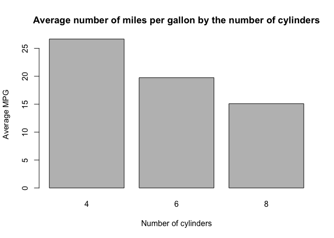
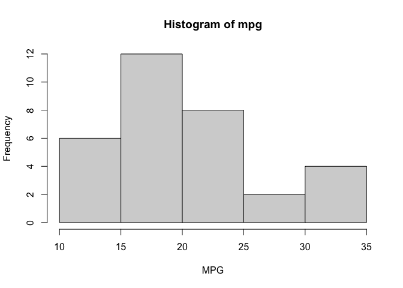
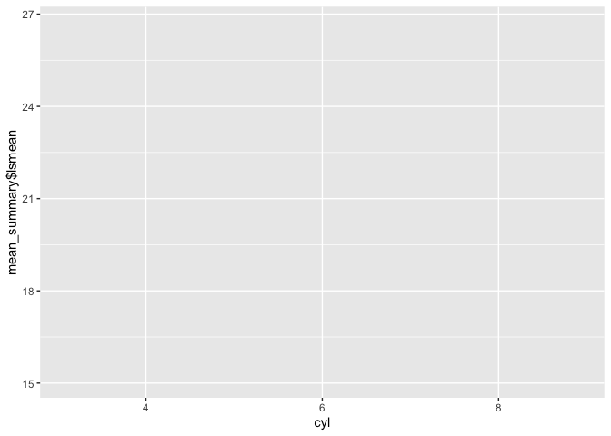
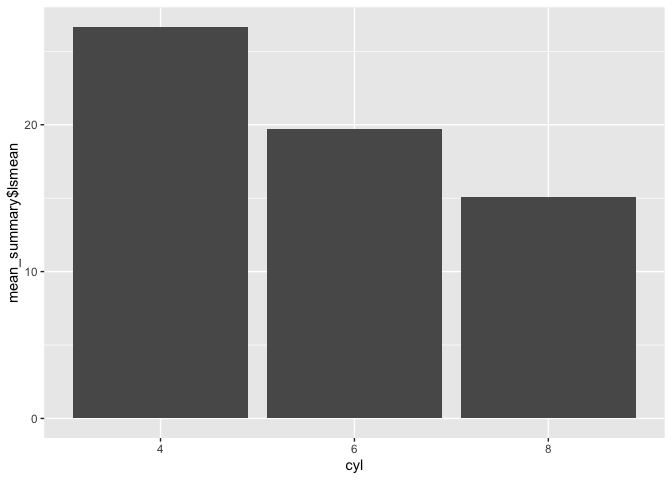
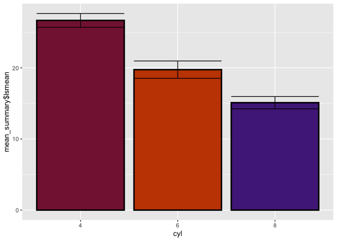
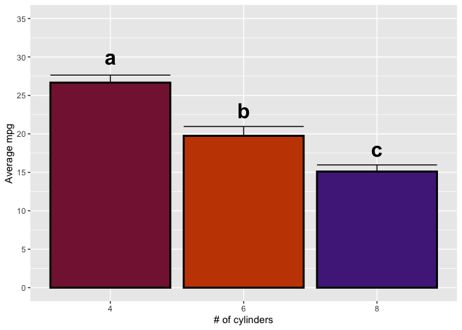
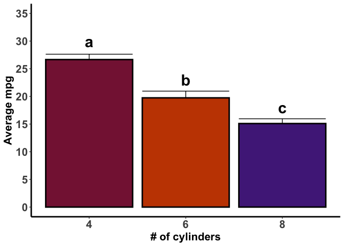
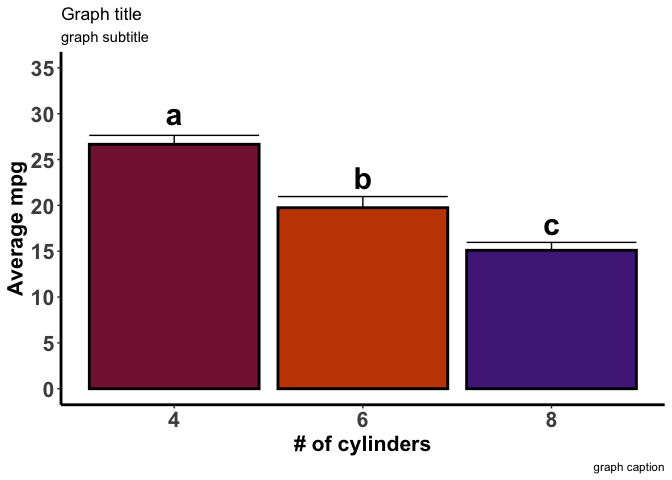
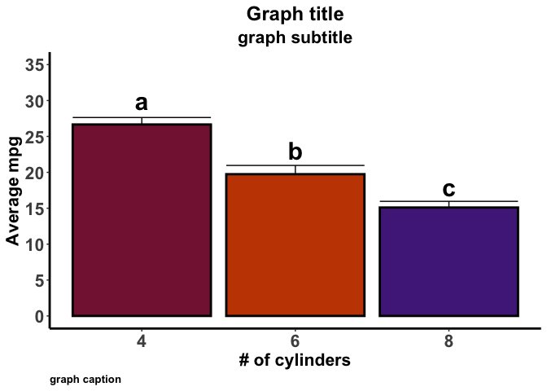

In this tutorial we will discuss how to make attractive and effective bar charts using R. Bar charts are a great way to visually show the results of your analysis if you are comparing the means of categorical variables. A bar chart makes it easy for folks who have never seen your data to quickly figure out which of your treatments are different. Before we begin, there are a couple of packages that you will need to install. The following code will install them when executed.

```r
if (!require(ggplot2)) {install.packages("ggplot2")}
if (!require(lsmeans)) {install.packages("lsmeans")}
```
# Base R plots

We can make bar charts using the ```barplot()``` function like below. The ```height = ``` argument specifies the height of each bar. In this case the vector of heights contains the values <span style="font-weight: bold">26.7, 19.7, and 15.1"". The ```names.arg =``` argument specifies the labels on the x axis (the category of each of the y values). The length of the names.arg (number of values in it) must match the length of the height or R will raise an exception (in this case the length is 3).


```r
#Note: I did some data processing to obtain these averages that is not shown. These values can be obtained by taking the average MPG for each level of cyl in the mtcars dataset.
barplot(height = means$avg_mpg,
        names.arg = means$cyl,
        main = "Average number of miles per gallon by the number of cylinders",
        xlab = "Number of cylinders",
        ylab = "Average MPG")
```

<!-- -->

The distribution of data can be viewed with the ```hist()``` function like below:

```r
hist(mtcars$mpg,
     xlab = "MPG",
     main = "Histogram of mpg")
```

<!-- -->

These functions provide a quick and easy way to visualize your data, but they are lacking aesthetically. Now, we can certainly change them here but in this tutorial we will use ggplot to create and manipulate a bar chart.  


First, lets load the ggplot2 package into memory so we can use it. Execute the following code:

```r
library(ggplot2)
library(lsmeans)
```

```
## Loading required package: emmeans
```

```
## The 'lsmeans' package is now basically a front end for 'emmeans'.
## Users are encouraged to switch the rest of the way.
## See help('transition') for more information, including how to
## convert old 'lsmeans' objects and scripts to work with 'emmeans'.
```

# Data generation

Let's consider the data we used above to create a bar chart like before. Generally, you will be making a bar chart after you obtain the results of a statistical analysis. To simulate this, we are going to run an example (the model is clearly misspecified but that's fine for this) analysis on the data. There are 3 categories of cyl in the data: 4, 6, and 8. By default, R will coerce numbers to a numeric type. Because we want to analyze them as a categorical variable we need to convert them to a factor. Below I save the mtcars dataset as `df` and convert cyl to a factor.

```r
df <- mtcars
df$cyl <- as.factor(df$cyl)
```

You can check the type of a variable in several ways. You can ask R what the class is using `class(object)`, or call `summary()` on the data frame. 

```r
class(df$cyl)
```

```
## [1] "factor"
```

```r
summary(df)
```

```
##       mpg        cyl         disp             hp             drat      
##  Min.   :10.40   4:11   Min.   : 71.1   Min.   : 52.0   Min.   :2.760  
##  1st Qu.:15.43   6: 7   1st Qu.:120.8   1st Qu.: 96.5   1st Qu.:3.080  
##  Median :19.20   8:14   Median :196.3   Median :123.0   Median :3.695  
##  Mean   :20.09          Mean   :230.7   Mean   :146.7   Mean   :3.597  
##  3rd Qu.:22.80          3rd Qu.:326.0   3rd Qu.:180.0   3rd Qu.:3.920  
##  Max.   :33.90          Max.   :472.0   Max.   :335.0   Max.   :4.930  
##        wt             qsec             vs               am        
##  Min.   :1.513   Min.   :14.50   Min.   :0.0000   Min.   :0.0000  
##  1st Qu.:2.581   1st Qu.:16.89   1st Qu.:0.0000   1st Qu.:0.0000  
##  Median :3.325   Median :17.71   Median :0.0000   Median :0.0000  
##  Mean   :3.217   Mean   :17.85   Mean   :0.4375   Mean   :0.4062  
##  3rd Qu.:3.610   3rd Qu.:18.90   3rd Qu.:1.0000   3rd Qu.:1.0000  
##  Max.   :5.424   Max.   :22.90   Max.   :1.0000   Max.   :1.0000  
##       gear            carb      
##  Min.   :3.000   Min.   :1.000  
##  1st Qu.:3.000   1st Qu.:2.000  
##  Median :4.000   Median :2.000  
##  Mean   :3.688   Mean   :2.812  
##  3rd Qu.:4.000   3rd Qu.:4.000  
##  Max.   :5.000   Max.   :8.000
```

R tells us that cyl is now a factor. Take a look at the summary output. Numeric variables will give summary statistics for the data, like for mpg. Factors and characters will give you the levels (in this case 4, 6, and 8), followed by the number of observations for each. 

Let's run the model. As I said, we will keep this simple to simulate how to go from analysis to graph easily. We will test to see if there is a difference in mpg depending on the number of cylinders and ignore everything else in the dataset. There are 2 ways of doing this. We can directly fit an analysis of variance (ANOVA) model using the `aov()` function, or we can fit a linear model using `lm()` and call the `anova()` function on it. Both of these will give the same result. This is because ANOVA is actually a special case of linear regression in which the variables are dummy coded. In fact we can get the estimates that are returned by calling `summary()` on `lm()` by calling `coef()` on the model fity with `aov()`. Anyways, lets run this:

```r
linear_mod <- lm(mpg ~ cyl, data = df)
anova_mod <- aov(mpg ~ cyl, data = df)
anova(linear_mod)
```

```
## Analysis of Variance Table
## 
## Response: mpg
##           Df Sum Sq Mean Sq F value    Pr(>F)    
## cyl        2 824.78  412.39  39.697 4.979e-09 ***
## Residuals 29 301.26   10.39                      
## ---
## Signif. codes:  0 '***' 0.001 '**' 0.01 '*' 0.05 '.' 0.1 ' ' 1
```

```r
summary(anova_mod)
```

```
##             Df Sum Sq Mean Sq F value   Pr(>F)    
## cyl          2  824.8   412.4    39.7 4.98e-09 ***
## Residuals   29  301.3    10.4                     
## ---
## Signif. codes:  0 '***' 0.001 '**' 0.01 '*' 0.05 '.' 0.1 ' ' 1
```

So we have some differences, which I'm sure you know if you looked at the graph we made in the scatter plot tutorial. What we really want here is the means and standard errors though. We can get them using the `lsmeans()` package. 

```r
linear_means <- lsmeans(linear_mod, ~cyl)
anova_means <- lsmeans(anova_mod, ~ cyl)
summary(linear_means)
```

```
##  cyl lsmean    SE df lower.CL upper.CL
##  4     26.7 0.972 29     24.7     28.7
##  6     19.7 1.218 29     17.3     22.2
##  8     15.1 0.861 29     13.3     16.9
## 
## Confidence level used: 0.95
```

```r
summary(anova_means)
```

```
##  cyl lsmean    SE df lower.CL upper.CL
##  4     26.7 0.972 29     24.7     28.7
##  6     19.7 1.218 29     17.3     22.2
##  8     15.1 0.861 29     13.3     16.9
## 
## Confidence level used: 0.95
```

Again, same thing so from now on I am just going to work with one. Having to type numbers into a spreadsheet or data frame to then graph is hard work. It's also a terrible way to work because it's prone to mistakes (copy/paste, manual entry, etc. should be avoided if at all possible). Instead, lets save this output and just use it to create the graph. 

```r
mean_summary <- summary(linear_means) 
```

Now we can access the means directly from `mean_summary`:

```r
mean_summary$lsmean
```

```
## [1] 26.66364 19.74286 15.10000
```

We have our data, so let's make a graph.

# Using ggplot to make a bar chart

The ```ggplot()``` function will initialize a new ggplot object. That is, it will create a new "base" plot that you can then add layers, or attributes to. I will generally assign this object to a variable so that I can call or modify it somewhere else in the script. For example, ```plt <- ggplot()``` will initialize an empty plot and assign it to the variable ```plt```. The plot can then be called by typing ```plt``` into the console and executing it. If you do this, you will get a blank graph. This is because we haven't given it any data to plot. Let's consider the first scatter plot we made where we plotted mpg against displacement in the mtcars data. This can be done in ggplot as follows:

```r
plt <- ggplot(data = mean_summary,
              mapping = aes(x = cyl,
                            y = mean_summary$lsmean))
```
The ```data = ``` argument specifies the dataset that you are creating the graph with, in this case it is the mean_summary data frame we created earlier. The ```mapping = ```argument defines the aesthetic (```aes()```) mapping for the chart. In English, this means that you are telling it how the chart is defined in relation to your data. In this case the x axis is the levels of cyl and the y axis is average mpg for each cyl level. There are other aesthetics that we can add as well, which we will go over in a bit. This argument actually doesn't <span style="font-style: italic">have"" to be defined here. But, if it is not defined here it must be supplied in each layer that is added. For most cases, it is easiest and best practice to define this in the initial ggplot() call.

If you execute this code you probably notice that nothing happens. This is because we have just initialized a ggplot object and assigned it to ```plt```. We haven't told the computer to produce our graph yet. Like before, this can be done by calling plt from the console. When you do this, you will notice that while our graph looks better, it's still missing the most important part: the data. 

```r
plt
```

<!-- -->

ggplot works by using layers to create a graph. This means that once we create our base plot, we add additional features, or layers, to it. Layers include things such as the data points, trend lines, axes, and annotations, to name a few. At this point the computer knows what data we want to use to create a graph, but it doesn't know how we want it displayed. Do we want a bar chart, scatter plot, line graph, or something else? We can tell it how to plot our values by adding a layer to the plot. This is done using a ```+``` after plt. In this case we want a bar chart, so we will use `geom_bar()`.

```r
plt + geom_bar(stat = "identity")
```

<!-- -->

Now we actually have data on the graph, so that's good. You'll notice that `stat = "identity"` is passed into `geom_bar()`. This tells the computer not to transform the data (graph the exact values we gave it). `geom_bar(stat = "identity")` is equivilent to `geom_col()`. We can add other attributes to the bars too. For example, we can specify the width (`width = `), size of the border (`size = `), color (`fill = `), and border color (`color = `) to name a few. Now try calling `plt` again. You get a blank graph (all that work for nothing...). This is because we haven't save the added layer to `plt`. To do this you simply do the following. Let's also show some school spirit and make it wildcat purple! But lets not get too carried away. I'm a Virginian, so lets add some Virginia Tech colors too! (In reality this is not a very good way to display this graph. Color elements on a graph should indicate something, such as a treatment. These mean nothing since the x axis provides that information. But since this is for demonstration purposes lets have some fun.)

```r
plt <- plt +
  geom_bar(stat = "identity",
           fill = c("#861F41", "#C64600", "#512888"),
           size = 1,
           color = "black")
#The hex colors in the fill are VT maroon, VT orange, and KSU purple in that order.
```

Now when we call `plt` we get what we are expecting. Keep in mind, if you are going to define `fill` by passing in a vector of colors then that vector needs to be the same length as the data being plotted. Generally, when we have bar charts we want to see error bars on them. Error bars can be added to the chart using `geom_errorbar()`. We need to tell this function how high our error bars need to be though. In other words, we need to specify the maximum and minimum height of the error bar. You can use either the standard error or confidence limits given in `mean_summary`. The minimum is the mean minus the standard error and the maximum is the mean plus the standard error, if you use SE. For confidence limits you can just use the limits.

```r
plt <- plt +
  geom_errorbar(aes(ymin = mean_summary$lsmean - mean_summary$SE,
                    ymax = mean_summary$lsmean + mean_summary$SE))
#For confidence limits the ymin would be mean_summary$lower.CL and the ymax would be mean_summary$upper.CL
plt
```

<!-- -->

Now we have our error bars. I don't usually like to show lower error bars: I think it makes the graph look messy. So I am going to take them off. If you would like to do this, just set the ymin to the mean.

```r
#This just removed the error bar layer that we already added.
plt$layers[2] <- NULL

plt <- plt +
  geom_errorbar(aes(ymin = mean_summary$lsmean,
                    ymax = mean_summary$lsmean + mean_summary$SE))

plt
```

<!-- -->

There are some things that need to be changed. The most obvious one is the y axis label. No one will know what on earth that means other than you. We can change the x and y axis label using `xlab()` and `ylab()`:

```r
plt <- plt +
  xlab("# of cylinders") +
  ylab("Average mpg")

plt
```

<!-- -->

That's much better. In a real analysis, we would be interested in which of our means are different. We can figure that out for our like below.

```r
summary(lsmeans(linear_mod, pairwise ~ cyl))
```

```
## $lsmeans
##  cyl lsmean    SE df lower.CL upper.CL
##  4     26.7 0.972 29     24.7     28.7
##  6     19.7 1.218 29     17.3     22.2
##  8     15.1 0.861 29     13.3     16.9
## 
## Confidence level used: 0.95 
## 
## $contrasts
##  contrast estimate   SE df t.ratio p.value
##  4 - 6        6.92 1.56 29 4.441   0.0003 
##  4 - 8       11.56 1.30 29 8.905   <.0001 
##  6 - 8        4.64 1.49 29 3.112   0.0112 
## 
## P value adjustment: tukey method for comparing a family of 3 estimates
```

<div class="note-box">
<span class="noteheader">Brief interpretation""
<p class="note">Without going into the statistics, the `pairwise ~ cyl` specifies that we want pairwise comparisons for cylinder. The output for this (under $contrasts) tells us that all of our means are significantly different, using the Tukey-Kramer method of pairwise comparisons. Now that we know this, we want to indicate that to the viewer of the graph. This is commonly done using letters above the bar. Bars that do not have a common letter are said to be significantly different. The largest value gets an a,  the second largest is b, and so on. If two means are similar they should have a similar letter, and a bar can have more than one letter above it. So if cylinders 4 and 8 were different but cylinder 6 was similar to both, the letter assignment would be <span style="font-weight: bold">4: a, 6: ab, 8: b"". But they're all different, so it will be <span style="font-weight: bold">4: a, 6: b, 8: c"". </p>
</div>

So basically we want to put some letters above our bars. We can do this using the `annotate()` function. This allows us to add annotations to our graph. But before we do, take a look at the y axis. The bar for 4 cylinders is pretty close to the top of the plot. This means if we put a letter above it, the letter won't have a lot of room to be positioned. We can fix this by adjusting the y axis. Since y is a continuous value, we will use `scale_y_continuous()` to make the adjustment. 

```r
plt <- plt +
  scale_y_continuous(breaks = seq(0, 35, by = 5),
                     limits = c(0, 35))

plt
```

<!-- -->

The `breaks = ` argument tells the computer how it should define the y axis and it takes a `seq()` object. In English, the above code says to place axis ticks between 0 and 35, with a tick every 5. The `limits = ` argument takes a vector that defines the limits of the y axis. Here I said the lower limit is 0 and the upper limit is 35. 

Now we will add the letters above the graph. `annotate()` requires you to specify the geometric object `geom = ` ("text" in this case), the x and y coordinates, and the label to add. You may be tempted to set the x values to either 4, 5 or 6 given the labels on the x axis. Remember though that those levels are factors (categorical) rather than continuous. In the coordinate plane these bars are actually centered at x = 1, x = 2, and x = 3. I will also make the letters bold by specifying the `fontface = ` and defining the font size using `size = `. 

```r
plt <- plt + 
  annotate(geom = "text",
           x = c(1, 2, 3),
           y = c(30, 23, 18),
           label = c("a", "b", "c"),
           fontface = "bold",
           size = 8)

plt
```

<!-- -->

In the above code I passed a vector in for x, y, and label. This is shorthand for the code below:

```r
plt <- plt +
  annotate(geom = "text",
           x = 1,
           y = 30,
           label = "a") +
  annotate(geom = "text",
           x = 2,
           y = 23,
           label = "b") +
  annotate(geom = "text",
           x = 3,
           y = 18,
           label = "c")
```

As you can see the first version is much more concise and easier to read. 

Now we have our letters above our bars denoting differences. I think its time to clean up the graph some. We likely want to make the font on the axes larger so it is easier to read, remove the grid background, and add some lines for our axes. These can be done using `theme()`.

```r
plt <- plt +
  theme(
    axis.title = element_text(size = 16,
                              face = "bold"),
    axis.text = element_text(size = 16,
                             face = "bold"),
    axis.line = element_line(size = 1),
    panel.background = element_blank()
  )

plt
```

<!-- -->

In the above code, `axis.title =` will change the axis labels. It requires an `element_text()` since it is text, which we use to define the size (16) and font face (bold here but you can use italic or bold.italic if you wanted). The `axis.text = ` is similar, but it changes the text by the tick marks. We added axis lines using `axis.line = `, which is set to an `element_line()` since it is a line. We define the size in mm here. If you wanted to, you can customize the appearance of the line using `linetype = `. For example `linetype = "dotted"` will create a dotted line.

We might also want to put a title for our graph so people know what it is. We can do this with `labs()`. Here you can set a title, subtitle, and caption.

```r
plt <- plt +
  labs(title = "Graph title",
       subtitle = "graph subtitle",
       caption = "graph caption")

plt
```

<!-- -->

But we probably want to make some adjustments so these fit well with the theme of the graph. We can do this with `theme()`:

```r
plt <- plt + 
  theme(
    plot.title = element_text(size = 18,
                              face = "bold",
                              hjust = 0.5),
    plot.subtitle = element_text(size = 16,
                                 face = "bold",
                                 hjust = 0.5),
    plot.caption = element_text(size = 10,
                                face = "bold",
                                hjust = 0)
  )

plt
```

<!-- -->

We set `plot.title`, `plot.subtitle`, and `plot.caption` to `element_text()` to modify attributes. `size = ` and `face = ` set the font size and bold it. `hjust = ` sets the horizontal justification. I want the title and subtitle centered, so the horizontal justification is 0.5. I want the caption left justified, so I set it equal to 0.

In most scientific plots you will likely only need the title. But just in case, now you know about a few other features. You also don't want a color palette like this in a real graph. It is preferred by most folks to go with neutral colors (black, grey, and variations of that). Additionally, the colors should mean something if they are not all the same. For example, if you are plotting interactive means you might assign a color to the main effect not on the x axis. For this particular graph, if you are going to use a color it should be the same color for each bar. 

# Summary

You should now be able to create an attractive bar chart in R. While at first it may seem like this is a lot of work to get a graph, in practice much of this can be wrapped inside functions that allow you to reuse code. For example, if you would like the theme of all graphs to be the same as we did here, you can write a function that applies that theme to your graph. Then, you just call the function for each graph on only specify the theme once. This is the idea behind the "Don't Repeat Yourself" principal of software development. 

Making graphs with code also makes it much easier to make the layout "perfect". Computers can position items on a page perfectly, so it is easier to get a consistent looking graph with minimal effort. For example, look at the letters above each of the bars; they are exactly centered above each bar. If you were to do this in Excel or PowerPoint, it would be very difficult to get the alignment perfect. Small alignment differences will become more apparent when the graph is made larger on a PowerPoint slide or a poster. We didn't do it in this example, but it would be quite easy to make each letter the same distance above each bar. Just set the y value of the `annotate` to `mean_summary$lsmean + x`, where x is how far above the bar you would like it (I did this in the final code as an example).   

In this example, we added and saved to plt for each layer. This lends itself well to creating an example like this, but it is inefficient and bad practice to do it when creating plots. Instead, define your plot once and add to it in the declaration using `+` like below. When added after a function, the `+` tells the computer that your code continues onto the next line. 

<span class="subheading">Final code""

```r
#Run a linear model to obtain least-squares means and standard errors to plot.
df <- mtcars
df$cyl <- factor(df$cyl)
linear_mod <- lm(mpg ~ cyl, data = df)
linear_means <- lsmeans(linear_mod, ~cyl)
mean_summary <- summary(linear_means)

#Plot means using ggplot
final_plt <- ggplot(data = mean_summary,
              mapping = aes(x = cyl,
                            y = mean_summary$lsmean)) +
  geom_bar(stat = "identity",
           fill = c("#861F41", "#C64600", "#512888"),
           size = 1,
           color = "black") +
  geom_errorbar(aes(ymin = mean_summary$lsmean,
                    ymax = mean_summary$lsmean + mean_summary$SE)) +
  xlab("# of cylinders") +
  ylab("Average mpg") +
  labs(title = "Graph title",
       subtitle = "graph subtitle",
       caption = "graph caption") +
  scale_y_continuous(breaks = seq(0, 35, by = 5),
                     limits = c(0, 35)) +
  annotate(geom = "text",
           x = c(1, 2, 3),
           y = mean_summary$lsmean + 4,
           label = c("a", "b", "c"),
           fontface = "bold",
           size = 8) +
  theme(
    plot.title = element_text(size = 18,
                              face = "bold",
                              hjust = 0.5),
    plot.subtitle = element_text(size = 16,
                                 face = "bold",
                                 hjust = 0.5),
    plot.caption = element_text(size = 10,
                                face = "bold",
                                hjust = 0),
    axis.title = element_text(size = 16,
                              face = "bold"),
    axis.text = element_text(size = 16,
                             face = "bold"),
    axis.line = element_line(size = 1),
    panel.background = element_blank()
  )

final_plt
```

<!-- -->
