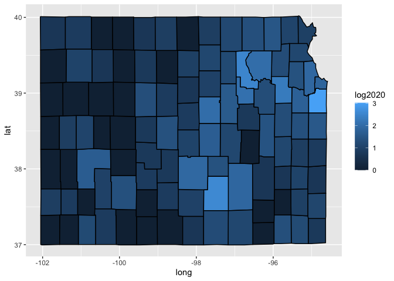
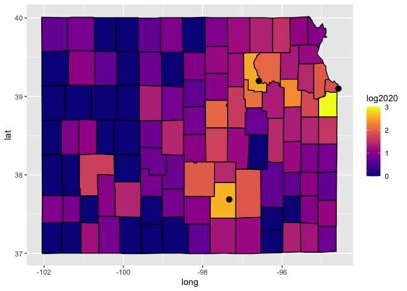
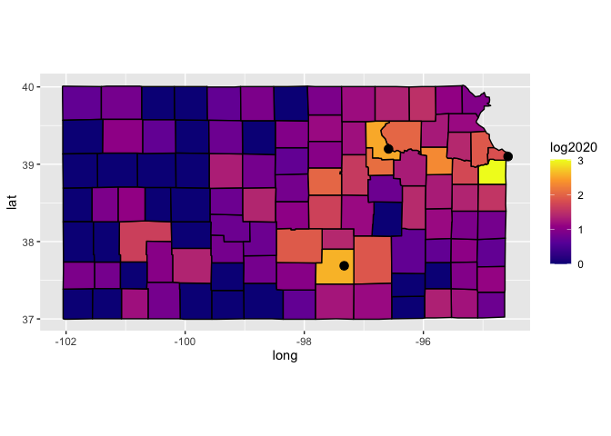
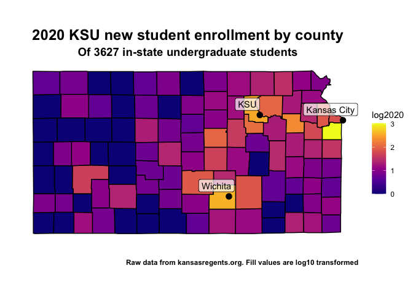

# Creating maps to visualize data in R
Maps can be used to visualize location-based data. In this example, we will show the distribution of incoming KSU students over the various counties in Kansas. This dataset is available from  https://submission.kansasregents.org/ibi_apps/portal/BIP_Public2/KHEStats

## Loading required packages
In order to generate a map of anything we need the coordinates of what we want to draw. That can be obtained through the `mapdata` package. 

```r
library(mapdata)
library(tidyverse)
library(readxl)
```

## Import the data
It defaults to an excel sheet for download, so we will use `read_xlsx()` to read it in as a data frame.

```r
setwd("/Users/chuckzumbaugh/Documents/Teaching/ASI 560/Spring 2021 Sheep/")
enrollment = read_xlsx("ksu_enrollment.xlsx")
```

## Prepare the data set to be used as a map
As it stands, the data set is not ready to be used to graph anything. The top and bottom contain a lot of extraneous information.

```r
head(enrollment)
```

```
## # A tibble: 6 x 10
##   `Kansas Board of Regen… ...2  ...3  ...4  ...5  ...6  ...7  ...8  ...9   ...10
##   <chr>                   <chr> <chr> <chr> <chr> <chr> <chr> <chr> <chr>  <chr>
## 1 Enrollment by Entering… <NA>  <NA>  <NA>  <NA>  <NA>  <NA>  <NA>  <NA>   <NA> 
## 2 Academic Years 2015 - … <NA>  <NA>  <NA>  <NA>  <NA>  <NA>  <NA>  <NA>   <NA> 
## 3 Kansas State University <NA>  <NA>  <NA>  <NA>  <NA>  <NA>  <NA>  <NA>   <NA> 
## 4 <NA>                    <NA>  <NA>  <NA>  <NA>  <NA>  <NA>  <NA>  <NA>   <NA> 
## 5 <NA>                    <NA>  Year  <NA>  <NA>  <NA>  <NA>  <NA>  <NA>   <NA> 
## 6 <NA>                    <NA>  2015  2016  2017  2018  2019  2020  1 Yea… 5 Ye…
```

```r
tail(enrollment)
```

```
## # A tibble: 6 x 10
##   `Kansas Board of Regen… ...2   ...3  ...4  ...5  ...6  ...7  ...8  ...9  ...10
##   <chr>                   <chr>  <chr> <chr> <chr> <chr> <chr> <chr> <chr> <chr>
## 1 <NA>                    Unkno… 53    44    68    ^     ^     ^     -     -    
## 2 <NA>                    Insti… 6,554 6,141 5,804 5,538 5,494 5,161 -6.1% -21.…
## 3 <NA>                    <NA>   <NA>  <NA>  <NA>  <NA>  <NA>  <NA>  <NA>  <NA> 
## 4 Source: KHEDS Academic… <NA>   <NA>  <NA>  <NA>  <NA>  <NA>  <NA>  <NA>  <NA> 
## 5 <NA>                    <NA>   <NA>  <NA>  <NA>  <NA>  <NA>  <NA>  <NA>  <NA> 
## 6 ^ Indicates a cell has… <NA>   <NA>  <NA>  <NA>  <NA>  <NA>  <NA>  <NA>  <NA>
```
There is the additional problem that numbers greater than or equal to 1,000 contain commas, which won't play nice if they are converted to numeric values. In order to get it to a data set that we can work with, we need to:

* Drop the first column (It's empty if the downloaded data set only contains 1 University)
* Remove the excess mess at the top and bottom
* Remove the actual data from the bottom that we don't want (totals, out-of state totals, etc.)
* Remove commas from numbers that contain them
* Rename the columns to something easier to work with

We can do this with the following:

```r
enrollment = enrollment %>% 
  select(-matches('Kansas Board of Regents')) %>%
  filter(!is.na(...2)) %>%
  slice(2: (n() - 5)) %>%
  sapply(function(x) gsub(",", "", x)) %>%
  as.data.frame(enrollment)

names(enrollment) = c("subregion", seq(2015, 2020, by = 1),
                      "1 year change", "5 year change")
head(enrollment)
```

```
##   subregion 2015 2016 2017 2018 2019 2020 1 year change 5 year change
## 1     Allen   15    9    6   10   13   11        -15.4%        -26.7%
## 2  Anderson   10    5   11    5   11    8        -27.3%        -20.0%
## 3  Atchison   27   36   29   35   12   14         16.7%        -48.1%
## 4    Barber    ^    7    7    5    ^    ^             -             -
## 5    Barton   42   41   37   28   27   25         -7.4%        -40.5%
## 6   Bourbon    6   11    7   10    6    5        -16.7%        -16.7%
```

```r
tail(enrollment)
```

```
##      subregion 2015 2016 2017 2018 2019 2020 1 year change 5 year change
## 100    Wallace    5    ^    ^    6    ^    ^             -             -
## 101 Washington   22   35   31   19   19   15        -21.1%        -31.8%
## 102    Wichita    ^   12   13   12   15    8        -46.7%             -
## 103     Wilson    ^    6    6    ^    ^    ^             -             -
## 104    Woodson    ^    6    ^    ^    ^    5             -             -
## 105  Wyandotte  106  106   92   86   81   68        -16.0%        -35.8%
```

Where we use dplyr pipes to:

1. Remove the first column by selecting all columns that do not match `Kansas board of Regents` (the name of the first column)
2. Remove all rows where the second column is `NA` (the mess at the top and bottom) using `filter()`
3. Remove the first and last 5 lines of the resulting data frame, which we don't want with `slice()`
4. Remove commas from numbers by passing an anonymous function to `sapply()` that uses `gsub()` to replace commas with nothing
5. Convert the matric returned by `sapply()` back to a data frame

Then we re-name the columns to something that makes sense. The county column, which I named `subregion` matches the column name for the counties in the map data frame that we will get later. 

You can see there's another problem. A lack of data is represented by a ^, which won't play nice with the map. I assume this means that no one came from there, so we want to set it to zero. We also need to lowercase the counties. This is because the county names in the map data frame are lowercased.

```r
enrollment$subregion = tolower(enrollment$subregion)
enrollment = enrollment %>%
  mutate(`2020` = as.numeric(`2020`)) %>%
  mutate(`2020` = case_when(is.na(`2020`) ~ 0,
                            TRUE ~ `2020`))
```
First we lowercase `subregion`, which is pretty straightforward. Then we do the following: First we try to convert the `2020` column to a numeric. The values with a `^` will fail to convert and become an `NA`. So then we use `mutate()` on the column again. If the value is `NA`, we set it to 0. Otherwise we leave it alone. This isn't the only way to do this. You could first convert the `^` to 0 and then convert the data to numeric as well.

Now we are ready to get the map data. We want data by county for Kansas.

```r
kansas_counties = map_data('county') %>%
  filter(region == 'kansas')
head(kansas_counties)
```

```
##        long      lat group order region subregion
## 1 -95.09954 37.73500   854 26406 kansas     allen
## 2 -95.54071 37.72927   854 26407 kansas     allen
## 3 -95.53498 38.03867   854 26408 kansas     allen
## 4 -95.08807 38.02721   854 26409 kansas     allen
## 5 -95.09954 37.73500   854 26410 kansas     allen
## 6 -95.52352 38.39390   855 26412 kansas  anderson
```

Here `map_data()` allows us to retrieve the latitude and longitude coordinates for the different counties in the U.S. We then filter it to include only those in Kansas using `filter()`. The latitude and longitude data allow us to draw shapes that resemble the county borders in Kansas. But in order to include the enrollment data in the map, it needs to be merged with out enrollment data. We can do this by joining the enrollment data on the map data using `left_join()`.

```r
merged = left_join(kansas_counties, enrollment, by = c("subregion")) %>%
  mutate('log2020' = log10(`2020`)) %>%
  mutate(log2020 = case_when(log2020 == -Inf ~ 0,
                             TRUE ~ log2020))
```

Since all counties are represented in the enrollment data we don't need to worry about `NA`s being introduced through the merge. But since the larger enrollment counties have values many times that of the under-represented counties, they can cause them to appear as if there are no students coming from them in the map. To get around this, we can log10 transform the data. This will re-scale it and allow better resolution for counties that have less than 100 students coming in 2020. Doing this will cause introduce `-Inf` because log10(0) does not exist, so we simply set those to 0.

The last bit of data that we may want are the locations of major landmarks (big cities, the university, etc.). Through the use of Google, we can find the coordinates of these cities. Here I put them in a separate data frame for use later.

```r
kansas_cities = data.frame(subregion = c("Kansas City", "Wichita", "KSU"),
                           lat = c(39.0997, 37.6872, 39.1974),
                           long = c(-94.5786, -97.3301, -96.5847))
```

Now, after all of that, we can start to make out map. We will use `ggplot()`, which is part of the ggplot2 package in tidyverse. First lets generate a new plot using the `merged` data frame. We set the x coordinates to the longitude and the y coordinates to latitude. We also need to give it a grouping. This is so that when we draw the counties the computer knows not to try to connect the points between counties. So everything in a group represents a single shape, and the rest is another distinct shape. 

```r
map = ggplot(data = merged,
             aes(x = long,
                 y = lat, 
                 group = subregion))
```

We can use `geom_polygon()` to draw shapes on the chart. Because we want to visualize this by incoming students, we set the `fill = ` argument to the log10 of incoming students. I want the county borders to be black, so I set the `color = ` argument to black.

```r
map = map + geom_polygon(aes(fill = log2020), color = "#000000")
map
```

<!-- -->

It's kind of ugly, but at least it resembles what we are after. The next thing I want to do is to add my landmarks. We can use points to represent their location, and `geom_point()` allows us to do this. I think `size = 3` gives a nice looking dot, but this can be set to whatever.

```r
map = map + geom_point(data = kansas_cities, aes(x = long, y = lat), size = 3) 
map
```

<!-- -->

You can keep the color scheme as this, but I prefer to use the plasma color range. This range does better for greyscale, color blindness, and proper interpretation. You can change this using:

```r
map = map + scale_fill_viridis_c(option = "plasma")
map
```

<!-- -->

It looks a little distorted, so we can set the x, y coordinate scaling using `coord_fixed()`. You can play with this value to change it to your liking.

```r
map = map + coord_fixed(1.3)
map
```

<!-- -->

I think that looks a bit more "Kansas-like". Now we want to add some labels to our points so folks know what they represent. We can do this through `annotate()`

```r
map = map + annotate(geom = "label",
           x = kansas_cities$long - 0.3,
           y = kansas_cities$lat + 0.2,
           label = kansas_cities$subregion, fill = "white", alpha = 0.7)
map
```

<!-- -->

Here I set the x and y so the label is offset up and to the left from the dot itself. I also gave it a slightly transparent, white background. From here, all there is left to do is some styling like removing the grid, getting rid of the coordinates, and adding titles.

```r
map = map + 
  xlab("") + 
  ylab("") +
  labs(title = "2020 KSU new student enrollment by county",
       subtitle = paste("Of ", sum(enrollment$`2020`), " in-state undergraduate students", sep = ""),
       caption = "Raw data from kansasregents.org. Fill values are log10 transformed") +
  theme(
    panel.background = element_blank(),
    plot.title = element_text(face = "bold",
                              size = 18,
                              hjust = 0.5),
    plot.subtitle = element_text(face = "bold",
                                 size = 14,
                                 hjust = 0.5),
    plot.caption = element_text(face = "bold"),
    axis.text =  element_blank(),
    axis.ticks = element_blank(),
    legend.position = "right"
  )
map
```

<!-- -->
