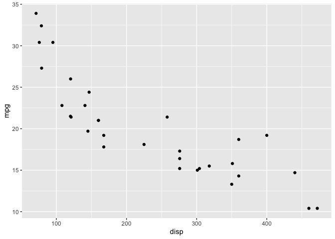
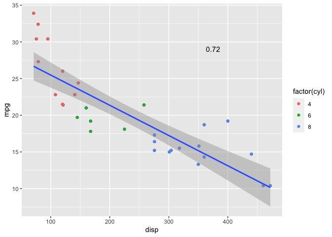

In this tutorial we will discuss how to make attractive and effective scatter plots using R. Before we begin, there are a couple of packages that you will need to install. The following code will install them when executed (copy and paste it into the console and hit enter).

```r
if (!require(ggplot2)) {install.packages("ggplot2")}
```

# The example dataset

To illustrate how to build a graph, we are going to use the "mtcars" data set that is built into R. This data set contains information such as miles per gallon, number of cylinders, displacement, and other car variables for various vehicles. The first few rows for the data set are shown below for visualization purposes.


```r
head(mtcars)
```

```
##                    mpg cyl disp  hp drat    wt  qsec vs am gear carb
## Mazda RX4         21.0   6  160 110 3.90 2.620 16.46  0  1    4    4
## Mazda RX4 Wag     21.0   6  160 110 3.90 2.875 17.02  0  1    4    4
## Datsun 710        22.8   4  108  93 3.85 2.320 18.61  1  1    4    1
## Hornet 4 Drive    21.4   6  258 110 3.08 3.215 19.44  1  0    3    1
## Hornet Sportabout 18.7   8  360 175 3.15 3.440 17.02  0  0    3    2
## Valiant           18.1   6  225 105 2.76 3.460 20.22  1  0    3    1
```

# Base R plots

Base R has built-in plot functions that can be used to make simple graphs. These are commonly used for simple visualization  during the cleaning and analysis processes. For example, the ```plot() ``` function will create a scatter plot for the x and y coordinates that are passed (put into the function) to it. We can also define other attributes of the plot such as the title and axis labels. We can add `main = ` inside the plot function to add a title, `xlab = ` to add an x axis label, and `ylab = ` to add a y axis label. 


```r
plot(x, y, 
     main = "A simple scatter plot of mpg vs disp from the mtcars dataset",
     xlab = "Displacement",
     ylab = "MPG")
```

<!-- -->

Functions like these provide easy ways to visualize your data while you are working with it. But as you can see, they aren't the most visually appealing plots. There are many arguments that could have been passed into each of these to customize them (type ```?plot```, ```?barplot```, or ```?hist``` to see them), but the ggplot2 package, in my opinion, is an easier way to make a production-quality chart. 

# Using ggplot2 to make a scatter plot

First, lets load the ggplot2 package into memory. Execute the following code:

```r
library(ggplot2)
```

The ```ggplot()``` function will initialize a new ggplot object. That is, it will create a new "base" plot that you can then add layers, or attributes to. I will generally assign this object to a variable so that I can call or modify it somewhere else in the script. For example, ```plt <- ggplot()``` will initialize an empty plot and assign it to the variable ```plt```. The plot can then be called by typing ```plt``` into the console and executing it. If you do this, you will get a blank graph. This is because we haven't given it any data to plot. Let's consider the first scatter plot we made where we plotted mpg against displacement in the mtcars data. This can be done in ggplot as follows:

```r
plt <- ggplot(data = mtcars,
              mapping = aes(x = disp,
                            y = mpg))
```
The ```data = ``` argument specifies the dataset that you are creating the graph with, in this case it is mtcars. The ```mapping = ```argument defines the aesthetic (```aes()```) mapping for the chart. In English, this means that you are telling it how the chart is defined in relation to your data. In this case the x axis is displacement and the y axis is mpg. There are other aesthetics that we can add as well, which we will go over in a bit. This argument actually doesn't <span style="font-style: italic">have</span> to be defined here. But, if it is not defined here it must be supplied in each layer that is added. For most cases, it is easiest and best practice to define this in the initial `ggplot()` call.

If you execute this code you probably notice that nothing happens. This is because we have just initialized a ggplot object and assigned it to ```plt```. We haven't told the computer to produce our graph yet. Like before, this can be done by calling `plt` from the console. When you do this, you will notice that while our graph looks better, it's still missing the most important part: the data. 

```r
plt
```

<!-- -->

ggplot works by using layers to create a graph. This means that once we create our base plot, we add additional features, or layers, to it. Layers include things such as the data points, trend lines, axes, and annotations, to name a few. At this point the computer knows what data we want to use to create a graph, but it doesn't know how we want it displayed. Do we want a bar chart, scatter plot, line graph, or something else? We can tell it how to plot our values by adding a layer to the plot. This is done using a ```+``` after plt. In this case we want a scatter plot, so we will use ```geom_point()``` to add points to the plot. The geom stands for geometric object, and the point is, well a data point.

```r
plt + geom_point()
```

<!-- -->

Now things are looking a bit better. But if you call `plt` again you will get the blank graph like before. This is because you have not 'saved' the new graph to `plt`. This is easily done with:

```r
plt <- plt + 
  geom_point()
```

We can add aesthetic attributes to these points. For example, lets say these data are grouped (perhaps by the number of cylinders) and we want to see how these groups look. Lets do it by color:

```r
#In the raw dataset cyl is a continuous, numeric variable. The factor(cyl) tells R to make it into a factor (categorical variable) instead.
plt <- plt + 
  geom_point(mapping = aes(color = factor(cyl)))
plt
```

<!-- -->

So with visual inspection, it seems that cars with fewer cylinders have lower displacement and get better gas mileage...makes sense. Okay, now lets say we want to see a trend line. we can do this with ```geom_smooth()```. To tell it how to create the line we need to add a ```method =``` argument. This tells the computer which method to use to fit the model. In this case we want to use a linear model, or "lm".

```r
plt <- plt + 
  geom_smooth(method = "lm")
plt
```

<!-- -->

This displays a linear trend line with 95% confidence bands around it. The confidence bands can be changed with the ```level = ``` argument. For example, if you want 99% confidence bands set it to 0.99. If you do not want it at all set it to `FALSE`. The default value is 95%. Now lets say we want to see how much variance in mpg is predicted by disp (English translation: We want an R<sup>2</sup> value on the chart). This is quite easy to do but it requires a few steps. First we actually have to create a linear regression model. This is done with the ```lm()``` function. We first pass in a formula to the function. The equation of a straight line is <span style="font-weight: bold">y = mx + b</span>, so our formula will need to take this form. We can do this as follows:

```r
#Note that mpg ~ disp tells the function to calculate the intercept and slope by regressing the y value mpg on the x value disp.
linear_reg <- lm(mpg ~ disp, data = mtcars)
```

We now need to get the summary of the model (it. intercept, slope, r2, etc.):

```r
linear_summary <- summary(linear_reg)
linear_summary
```

```
## 
## Call:
## lm(formula = mpg ~ disp, data = mtcars)
## 
## Residuals:
##     Min      1Q  Median      3Q     Max 
## -4.8922 -2.2022 -0.9631  1.6272  7.2305 
## 
## Coefficients:
##              Estimate Std. Error t value Pr(>|t|)    
## (Intercept) 29.599855   1.229720  24.070  < 2e-16 ***
## disp        -0.041215   0.004712  -8.747 9.38e-10 ***
## ---
## Signif. codes:  0 '***' 0.001 '**' 0.01 '*' 0.05 '.' 0.1 ' ' 1
## 
## Residual standard error: 3.251 on 30 degrees of freedom
## Multiple R-squared:  0.7183,	Adjusted R-squared:  0.709 
## F-statistic: 76.51 on 1 and 30 DF,  p-value: 9.38e-10
```

There's a lot here, so here is what you are looking for. Under coefficients, the estimates give you the intercept (intercept) and slope (disp). The R<sup>2</sup> is shown at the bottom with multiple R<sup>2</sup> and adjusted R<sup>2</sup>. The R<sup>2</sup> that you are looking for here is multiple R<sup>2</sup>. The adjusted R<sup>2</sup> is used for more complicated models and adjusts the value based on the number of predictors in the model. 

We can now add it to the plot with `annotate()`.

```r
plt <- plt + 
  annotate(geom = "text",
                      x = 375,
                      y = 29,
                      label = round(linear_summary$r.squared, digits = 2))
plt
```

<!-- -->

Here, we gave annotate 4 arguments. The `geom = ` argument specifies the type of geometric object we are adding (in this case text). The x and y arguments specify the position of the annotation on the plot. The `label = ` is the text that we want to report. I set this to the R<sup>2</sup> value in the summary of the linear model we made using  `$` to extract the value from the list. Because this value is quite long, I rounded it to 2 decimal places. This can be changed by changing the 2 to whatever number you like. 

This fits okay, but the data actually seem to follow a quadratic pattern. Lets see if that looks any better. First, we will create the formula:

```r
quadratic_reg <- lm(mpg ~ poly(disp, 
                               degree = 2, 
                               raw = TRUE), data = mtcars)
quad_summary <- summary(quadratic_reg)
quad_summary
```

```
## 
## Call:
## lm(formula = mpg ~ poly(disp, degree = 2, raw = TRUE), data = mtcars)
## 
## Residuals:
##     Min      1Q  Median      3Q     Max 
## -3.9112 -1.5269 -0.3124  1.3489  5.3946 
## 
## Coefficients:
##                                       Estimate Std. Error t value Pr(>|t|)    
## (Intercept)                          3.583e+01  2.209e+00  16.221 4.39e-16 ***
## poly(disp, degree = 2, raw = TRUE)1 -1.053e-01  2.028e-02  -5.192 1.49e-05 ***
## poly(disp, degree = 2, raw = TRUE)2  1.255e-04  3.891e-05   3.226   0.0031 ** 
## ---
## Signif. codes:  0 '***' 0.001 '**' 0.01 '*' 0.05 '.' 0.1 ' ' 1
## 
## Residual standard error: 2.837 on 29 degrees of freedom
## Multiple R-squared:  0.7927,	Adjusted R-squared:  0.7784 
## F-statistic: 55.46 on 2 and 29 DF,  p-value: 1.229e-10
```

The `poly()` says that we want to generate a model that predicts mpg based on a 2nd degree polynomial (quadratic). The `raw = TRUE` tells R that we want the raw polynomial instead of it fitting an orthogonal polynomial (if you're interested this is described a bit below).
Our line now explains the data better than it was before, so lets add it to the graph. (R<sup>2</sup> is not the end-all-be-all for selecting the best fit model. In fact, the R<sup>2</sup> we used will always improve with additional terms, regardless of their contribution to the model. For this reason, adjusted-R<sup>2</sup> and other metrics are usually used.)


```r
plt$layers[3:4] <- NULL
plt <- plt +
  geom_smooth(method = "lm",
              formula = y ~ poly(x, 2))

plt
```

<!-- -->

Don't worry about the first line, I was just removing the linear trend line and the R<sup>2</sup> value we already added. The geom_smooth for a quadratic function is largely the same as before, except that we specified the formula. In this case we gave it a second degree polynomial. Lets add the new R<sup>2</sup>:

```r
plt <- plt +
  annotate(geom = "text",
           x = 375,
           y = 29,
           label = paste("R-square: ", round(quad_summary$r.squared, digits = 2), sep = ""))

plt
```

<!-- -->

Technically, you can keep increasing the degree of polynomial up to N - 1 (where N is the number of data points) and you will keep getting a better R2. The problem with this is that you get an equation that is not useful. That is, it predicts the sample data very well but will not predict new data well, and you will often get wild predictions. This is what's known as over fitting. You want the simplest model that accurately fits your data. In this case, a 3<sup>rd</sup> degree polynomial actually fits the best. But for simplicity, we will just leave it as-is. 

<div class="note-box">
<span class="noteheader">Math note (optional read):</span>
<p class="note">So I said above that I wanted to get the equation for the raw polynomial. This equation is the same that would be generated if you added a 2<sup>nd</sup> order polynomial to a graph in a spreadsheet program such as Excel. If this is not specified, R will generate an orthogonal polynomial that is fit in the linear model. In regression models this helps to avoid an issue known as multicolinearity. This happens when variables added to the model are highly correlated with each other. If we take x and square it, the squared term is highly correlated with the original value. As you add more of these terms to the model the problem grows. The problem with this is that it results in wild and unreliable estimates. As we keep increasing the order of the equation, the lower order terms will change drastically. You can see this my comparing the summary of the quadratic regression above with and without the `raw = TRUE` term. There's a lot of linear algebra going on here, but essentially the terms are reparameterized so they are un correlated. This adds stability to the model as you increase the degree of polynomial. The down side is that the estimates that are kicked out are difficult to interpret by themselves. For example, in the equation displayed on the graph you can plug in 300 for x and get a value around 15. If you did the same with the estimates from the orthogonal polynomial you would get a much different value. So it doesn't lend itself well to putting the equation on the chart. However, both models will actually give the same predictions. If you simulated some data and used the `predict()` function on both models you would get the same result.</p>
</div>


Let's make it pretty. First, lets re-label the axes and add a title:

```r
plt <- plt +
  xlab("Displacement, cu. in.") +
  ylab("Miles per gallon") +
  labs(title = "Miles per gallon vs displacement",
       subtitle = "For 4, 6, and 8 cylinder cars",
       caption = "Source: mtcars dataset")

plt
```

<!-- -->

The `xlab()` and `ylab()` define the names of the x and y labels. The `labs()` allows you to add other labels. Title is the main graph title, and subtitle adds a smaller subtitle under the main title. The caption allows you to add a figure caption, for example the source of the data. Depending on what you are graphing these may or may not be of use, but I wanted to show you they exist.

It's still lacking, in my opinion. We can change a lot of attributes using `theme()`. For example, we can change fonts, add axis lines, change the background, and much more. Let's also add the equation for the trend line.


```r
plt <- plt +
  annotate(geom = "text",
           x = 375,
           y = 31,
           label = paste("y==", 
                         round(quad_summary$coefficients[3], 5), 
                         "*x^2",
                         round(quad_summary$coefficients[2], 2),
                         "*x+",
                         round(quad_summary$coefficients[1], 2)),
           parse = TRUE,
           fontface = "bold") +
  theme(
    title = element_text(size = 18,
                         face = "bold"),
    axis.title = element_text(size = 16,
                              face = "bold"),
    axis.text = element_text(size = 16,
                             face = "bold"),
    axis.line = element_line(size = 1),
    panel.background = element_blank()) +
  guides(color = guide_legend(title = "# of cylinders"))
plt
```

<!-- -->

## annotate()

There's a fair bit going on here, so lets break down `annotate()`. The first 3 arguments are the same as what we used for the R2, except I positioned it higher on the y axis so it was above the R2 value. The label looks complicated, but it is not. Here we are fitting a quadratic function. The equation for a quadratic function is <span class="equation">y = ax<sup>2</sup> + bx + c</span> where a is the coefficient for the quadratic term, b is the coefficient for the linear term, and c is the intercept. If this was a straight line your equation would be of the form <span class="equation">y = mx + b</span>. The paste function concatenates strings. That is, it takes several strings and puts them together into a single string. We form the equation string with it. The first string is the `"y = "`, then we add on the linear and quadratic coefficients. If you remember the summary output from above, the quadratic term is the third coefficient. So we access the list of coefficients in the summary, and take the third element. Then we paste an "x^2" after it. We then access the linear coefficient (the second term) and add it to the equation. Finally, we add the intercept, which is the first coefficient.

<div class="note-box">
<span class="noteheader">Special details of the paste function:</span>
<p class="note">There are actually some special attributes to what I put inside the paste function, and I need to explain what is going on. All of this is so the squared term has the 2 as a superscript rather than just ^2. The `round(quad_summary$coefficients[x])` portion just grabs the right coefficients and rounds them so they aren't 10 digits long. If you look below the `label` I am asking the computer to `parse` the label. Parsing essentially means to analyze the string. For this example, I want it to read and interpret what I have given it, and output it to me in equation format. The first term, I am setting y equal to what follows. This is done using a double equal sign. The second string I put in is `"*x^2"`. The `*` means multiply, so multiply the previous term by this, and the carrot means square. The final string is `"*x+"`. This means to multiply the previous value by x, and then add the next value. In the end this gives us something that looks a bit more "equation like". In fact, we can do the same thing for the R-square. See the final code for how to do this.</p>

</div>

## theme()

Now let's look at `theme()`. With the `title = ` argument I specify the format of the title. It takes an `element_text()` object (makes sense since it is a text). I want it font size 18, and bolded. `face = ` will specify the font face. You can use bold, italic, plain, or bold.italic. 

The `axis.title = ` will define the format for the axis labels and the `axis.text = ` will define the format for the axis tick labels. Like the title, these take `element_text()` objects since they are text. I want these font size 16 and bolded.

The `axis.line = ` will tell the computer to put lines for the x and y axes. This takes an `element_line()` object (since it's a line). The size specifies the size of the line in mm, and I want 1 mm. If for some reason you wanted a different style line (ex. dotted line) this can be specified by adding `linetype = ` to the element_line (`element_line(..., linetype = "dotted")`). 

The `panel.background = ` allows you to specify the background for the panel. I don't want one (I personally don't like grid lines unless there is a good reason for them), so it set it to `element_blank()` to say it's blank. 

## guides()

The `guides()` in this case changes the legend. Obviously, factor(cyl) isn't a very good title for the legend. Someone who doesn't know what we did will likely be confused by it. Our points are grouped by color, so we need to define the legend for color. For this case, all I want to change is the title, so I set the title to "# of cylinders". There are other ways you can customize the legend and you can look them up by typing `?guide_legend` into the console.

Let's say we don't like the colors that R gave us for the points. If we decide to change them, we can actually define the legend title without the use of `guides()`. The color can be adjusted manually using `scale_color_manual()`. You can pass in the colors by name (ex. red, blue, etc.), but if there's a precise color that you want you will likely need to do it using hex colors. You can look up the hex color for a specific color on google easily.

```r
plt <- plt +
  scale_color_manual(name = "# of cylinders",
                     values = c("purple", "#dc143c", "#FF00FF"))
# #dc143c is hex color for crimson, #FF00FF is hex color for magenta
plt
```

<!-- -->

In this case I think the scale of the axes looks pretty good. If for some reason we needed to change it we could use the `scale_y_continuous()` and `scale_x_continuous()` functions. While you likely won't need to do this for scientific plots, you can easily change the color of the axis lines or ticks by passing a `color = ` argument to `element_line()` or `element_text()`. Like with the points, these are strings and can be the name of the color (ex. purple) or the hex color. 

## Grid lines

In this example we did not add grid lines to the plot. As I said, in most cases I am not a fan of grid lines, but this is a personal opinion. If you would like to add grid lines you can do so using `panel.grid...`. Here I added grid lines to the major ticks on the y axis using `panel.grid.major.y = `. If you were interested in adding grid lines to minor ticks you can set the `panel.grid.minor.y = ` property. I also set the major grid lines on the x axis to `element_blank()`. If this is not done you will get small breaks in the line at the x axis ticks, as R will place a white line there. You may also want a different background color. You can do this by changing the `fill = ` property in the `panel.background`. Note that if you wish to use grid lines you may need to adjust the y axis position of the equation and R<sup>2</sup> annotations.  


```r
plt <- plt +
  theme(
    panel.background = element_rect(fill = "white"),
    panel.grid.major.y = element_line(color = "grey",
                                      size = 0.5,
                                      linetype = "solid"),
    panel.grid.major.x = element_blank() #If this is not set you will have white grid lines at the major ticks on the x axis. This results in what appear as breaks in the y axis grid lines.
  )

plt
```

<!-- -->

# Summary

You should now be able to create an attractive scatter plot in R. While at first it may seem like this is a lot of work to get a graph, in practice much of this can be wrapped in functions that allow you to produce similar graphs. For example, if you would like the theme of all graphs to be the same as we did here you can write a function that applies that theme to your graph. Then, you just call the function for each graph on only specify the theme once. This is the idea behind the "Don't Repeat Yourself" principal of software development.  

In this example, we added and saved to plt for each layer. This lends itself well to creating an example like this, but it is inefficient and bad practice to do it when creating plots. Instead, define your plot once and add to it in the declaration using `+` like below.

## Final code


```r
quadratic_reg <- lm(mpg ~ poly(disp, degree = 2), data = mtcars)
quad_summary <- summary(quadratic_reg)
quad_summary
```

```
## 
## Call:
## lm(formula = mpg ~ poly(disp, degree = 2), data = mtcars)
## 
## Residuals:
##     Min      1Q  Median      3Q     Max 
## -3.9112 -1.5269 -0.3124  1.3489  5.3946 
## 
## Coefficients:
##                         Estimate Std. Error t value Pr(>|t|)    
## (Intercept)              20.0906     0.5015  40.061  < 2e-16 ***
## poly(disp, degree = 2)1 -28.4410     2.8369 -10.025 6.23e-11 ***
## poly(disp, degree = 2)2   9.1524     2.8369   3.226   0.0031 ** 
## ---
## Signif. codes:  0 '***' 0.001 '**' 0.01 '*' 0.05 '.' 0.1 ' ' 1
## 
## Residual standard error: 2.837 on 29 degrees of freedom
## Multiple R-squared:  0.7927,	Adjusted R-squared:  0.7784 
## F-statistic: 55.46 on 2 and 29 DF,  p-value: 1.229e-10
```

```r
final_plt <- ggplot(data = mtcars,
              mapping = aes(x = disp,
                            y = mpg)) +
  geom_point(mapping = aes(color = factor(cyl))) +
  geom_smooth(method = "lm",
              formula = y ~ poly(x, 2)) +
  annotate(geom = "text",
           x = 375,
           y = 29,
           label = paste("italic(R)^2 ==", round(quad_summary$r.squared, digits = 2), sep = ""),
           parse = TRUE) +
  annotate(geom = "text",
           x = 375,
           y = 31,
           label = paste("y== ", 
                         round(quad_summary$coefficients[3], 2), 
                         "*x^2", 
                         round(quad_summary$coefficients[2], 2),
                         "*x+ ",
                         round(quad_summary$coefficients[1], 2), 
                         sep = ""),
           fontface = "bold",
           parse = TRUE) +
  xlab("Displacement, cu. in.") +
  ylab("Miles per gallon") +
  labs(title = "Miles per gallon vs displacement",
       subtitle = "For 4, 6, and 8 cylinder cars",
       caption = "Source: mtcars dataset") +
  theme(
    title = element_text(size = 18,
                         face = "bold"),
    axis.title = element_text(size = 16,
                              face = "bold"),
    axis.text = element_text(size = 16,
                             face = "bold"),
    axis.line = element_line(size = 1),
    panel.background = element_blank()
  ) +
  guides(color = guide_legend(title = "# of cylinders"))

final_plt
```

<!-- -->
